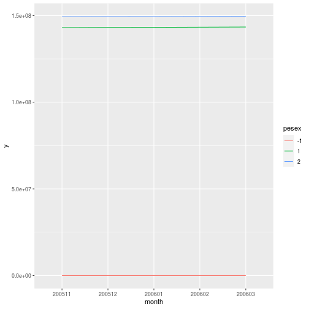
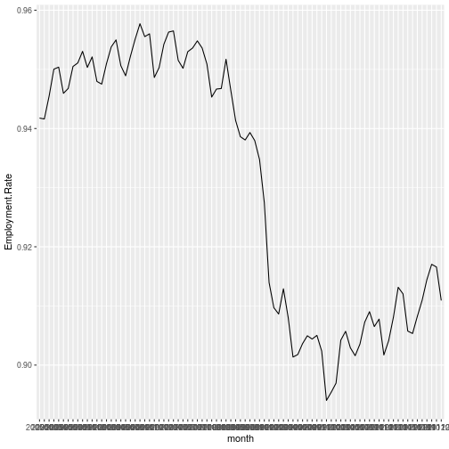

# Data: Current Population Survey

`dataCPS` is an R package that pulls CPS public microdata from the census bureau website on install and packs it into an 
## Installation.

To install  the package, execute:

```r
devtools::install_github("DanielBonnery/dataCPS")
```
Note that installation is slow, because part of the installation process is the downloading of data from the Census Bureau website.

# Demonstration


```r
data("cps200501",package="dataCPS")
summary(cps200501)
```

```
##     hrhhid            hrintsta            hrmis             hrhhid2            gestfips        
##  Length:156657      Length:156657      Length:156657      Length:156657      Length:156657     
##  Class :character   Class :character   Class :character   Class :character   Class :character  
##  Mode  :character   Mode  :character   Mode  :character   Mode  :character   Mode  :character  
##                                                                                                
##                                                                                                
##                                                                                                
##      peage          pesex             pulineno           pehspnon           prpertyp        
##  Min.   :-1.00   Length:156657      Length:156657      Length:156657      Length:156657     
##  1st Qu.:11.00   Class :character   Class :character   Class :character   Class :character  
##  Median :32.00   Mode  :character   Mode  :character   Mode  :character   Mode  :character  
##  Mean   :32.54                                                                              
##  3rd Qu.:51.00                                                                              
##  Max.   :85.00                                                                              
##     pemlr              pwsswgt           pwcmpwgt    
##  Length:156657      Min.   :    0.0   Min.   :    0  
##  Class :character   1st Qu.:  609.9   1st Qu.:    0  
##  Mode  :character   Median : 1919.8   Median : 1186  
##                     Mean   : 1850.4   Mean   : 1435  
##                     3rd Qu.: 2813.5   3rd Qu.: 2613  
##                     Max.   :32265.5   Max.   :31739
```

```r
library(dataCPS)
data("cps200501",package="dataCPS")
monthsinperiod("200511","200603")
```

```
## [1] "200511" "200512" "200601" "200602" "200603"
```

```r
cps200511.200603<-rbind_period("200511","200603",c("pwsswgt","pesex","pemlr"))
Y<-plyr::ddply(
  cps200511.200603,
  ~month+pesex,
  function(d){data.frame(y=sum(d$pwsswgt))})
library(ggplot2)
graph1<-ggplot(data=Y,aes(x=month,y=y,group=pesex,color=pesex))+geom_line()
print(graph1)
```



In this example we plot the direct estimate of the unemployment rate:

```r
  cps200501.201201<-rbind_period("200501","201201",c("pwsswgt","pesex","pemlr"))
Y<-plyr::daply(cps200501.201201,
  ~month+pemlr,
  function(d){sum(d$pwsswgt)})

U<-apply(Y[,c("1","2")],1,sum)/apply(Y[,c("1","2","3","4")],1,sum)
graph2<-ggplot(data=data.frame(month=names(U),Employment.Rate=U),
               aes(x=month,y=Employment.Rate,group = 1))+geom_line()
graph2
```



