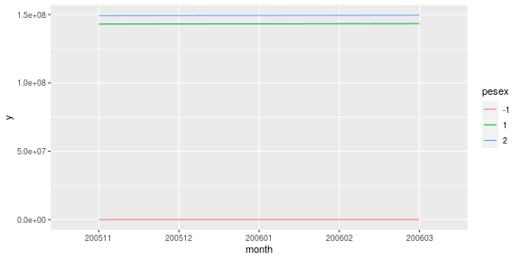
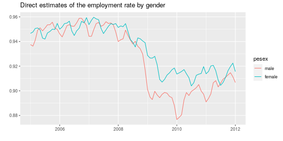

# Data: Current Population Survey

`dataCPS` is an R package that pulls CPS public microdata from the census bureau website on install and packs it into an 
## Installation.

To install  the package, execute:

```r
devtools::install_github("DanielBonnery/dataCPS")
```
Note that installation is slow, because part of the installation process is the downloading of data from the Census Bureau website.


## Detailed Documentation

Refer to the dataCPS R package pdf documentation manual available on the github repo:
[https://github.com/DanielBonnery/dataCPS/blob/master/dataCPS.pdf](dataCPS.pdf)

# Demonstration

By default, the package downloads zip files, and only select some variables, as shown in the following summary:


```r
data("cps200501",package="dataCPS")
summary(cps200501)
```

```
##     hrhhid            hrintsta            hrmis             hrhhid2            gestfips        
##  Length:156657      Length:156657      Length:156657      Length:156657      Length:156657     
##  Class :character   Class :character   Class :character   Class :character   Class :character  
##  Mode  :character   Mode  :character   Mode  :character   Mode  :character   Mode  :character  
##                                                                                                
##                                                                                                
##                                                                                                
##      peage          pesex             pulineno           pehspnon           prpertyp        
##  Min.   :-1.00   Length:156657      Length:156657      Length:156657      Length:156657     
##  1st Qu.:11.00   Class :character   Class :character   Class :character   Class :character  
##  Median :32.00   Mode  :character   Mode  :character   Mode  :character   Mode  :character  
##  Mean   :32.54                                                                              
##  3rd Qu.:51.00                                                                              
##  Max.   :85.00                                                                              
##     pemlr              pwsswgt           pwcmpwgt    
##  Length:156657      Min.   :    0.0   Min.   :    0  
##  Class :character   1st Qu.:  609.9   1st Qu.:    0  
##  Mode  :character   Median : 1919.8   Median : 1186  
##                     Mean   : 1850.4   Mean   : 1435  
##                     3rd Qu.: 2813.5   3rd Qu.: 2613  
##                     Max.   :32265.5   Max.   :31739
```


If other variables are wanted, use the `dataCPS::get_data_from_web` function.
Following example downloads the data for January 2005 and creates a data frame that contains all the variables available. Variable names are then displayed.


```r
DD<-dataCPS::get_onemonth_data_from_web(as.Date("20050101","%Y%m%d"))
```

```
## This is the first time the package dataCPS is loaded. Data is going to be downloaded from the Census Website.
##                           A connection to the web is needed.
```

```
## Warning in download.file(url = file.path("http://www.nber.org/data/progs/cps-basic", : URL 'http://
## data.nber.org/data/progs/cps-basic/cpsbjan07.sas': status was 'Server returned nothing (no headers, no
## data)'
```

```
## Error: .onLoad failed in loadNamespace() for 'dataCPS', details:
##   call: download.file(url = file.path("http://www.nber.org/data/progs/cps-basic", 
##   error: cannot open URL 'http://www.nber.org/data/progs/cps-basic/cpsbjan07.sas'
```

```r
sapply(DD,typeof)
```

```
##      hrhhid     hrmonth     hryear4    hurespli     hufinal    huspnish    hetenure    hehousut 
## "character"    "double"    "double"    "double"    "double"    "double"    "double"    "double" 
##    hetelhhd    hetelavl    hephoneo    hufaminc     hutypea      hutypb      hutypc     hwhhwgt 
##    "double"    "double"    "double"    "double"    "double"    "double"    "double"    "double" 
##    hrintsta    hrnumhou     hrhtype       hrmis    huinttyp    huprscnt    hrlonglk     hrhhid2 
##    "double"    "double"    "double"    "double"    "double"    "double"    "double"    "double" 
##       hubus     hubusl1     hubusl2     hubusl3     hubusl4       gereg     gestcen    gestfips 
##    "double"    "double"    "double"    "double"    "double"    "double"    "double" "character" 
##      gtcbsa        gtco    gtcbsast    gtmetsta    gtindvpc    gtcbsasz       gtcsa    proldrrp 
## "character" "character"    "double"    "double"    "double"    "double" "character"    "double" 
##     pupelig       perrp    peparent       peage     prtfage    pemaritl    pespouse       pesex 
##    "double"    "double"    "double"    "double"    "double"    "double"    "double"    "double" 
##    puafever    peafwhen     peafnow     peeduca    prdtrace     prdthsp    puchinhh    purelflg 
##    "double"    "double"    "double"    "double"    "double"    "double"    "double"    "double" 
##    pulineno    prfamnum    prfamrel    prfamtyp    pehspnon    prmarsta    prpertyp    penatvty 
##    "double"    "double"    "double"    "double"    "double"    "double"    "double"    "double" 
##    pemntvty    pefntvty    prcitshp    prcitflg    prinusyr    puslfprx       pemlr        puwk 
##    "double"    "double"    "double"    "double"    "double"    "double"    "double"    "double" 
##      pubus1    pubus2ot    pubusck1    pubusck2    pubusck3    pubusck4     puretot       pudis 
##    "double"    "double"    "double"    "double"    "double"    "double"    "double"    "double" 
##      peret1      pudis1      pudis2     puabsot       pulay    peabsrsn    peabspdo      pemjot 
##    "double"    "double"    "double"    "double"    "double"    "double"    "double"    "double" 
##     pemjnum    pehrusl1    pehrusl2    pehrftpt    pehruslt    pehrwant    pehrrsn1    pehrrsn2 
##    "double"    "double"    "double"    "double"    "double"    "double"    "double"    "double" 
##    pehrrsn3    puhroff1    puhroff2     puhrot1     puhrot2    pehract1    pehract2    pehractt 
##    "double"    "double"    "double"    "double"    "double"    "double"    "double"    "double" 
##     pehravl     puhrck1     puhrck2     puhrck3     puhrck4     puhrck5     puhrck6     puhrck7 
##    "double"    "double"    "double"    "double"    "double"    "double"    "double"    "double" 
##    puhrck12     pulaydt     pulay6m    pelayavl    pulayavr     pelaylk    pelaydur    pelayfto 
##    "double"    "double"    "double"    "double"    "double"    "double"    "double"    "double" 
##    pulayck1    pulayck2    pulayck3        pulk      pelkm1      pulkm2      pulkm3      pulkm4 
##    "double"    "double"    "double"    "double"    "double"    "double"    "double"    "double" 
##      pulkm5      pulkm6     pulkdk1     pulkdk2     pulkdk3     pulkdk4     pulkdk5     pulkdk6 
##    "double"    "double"    "double"    "double"    "double"    "double"    "double"    "double" 
##     pulkps1     pulkps2     pulkps3     pulkps4     pulkps5     pulkps6     pelkavl     pulkavr 
##    "double"    "double"    "double"    "double"    "double"    "double"    "double"    "double" 
##    pelkll1o    pelkll2o     pelklwo     pelkdur     pelkfto    pedwwnto     pedwrsn     pedwlko 
##    "double"    "double"    "double"    "double"    "double"    "double"    "double"    "double" 
##      pedwwk     pedw4wk    pedwlkwk     pedwavl     pedwavr     pudwck1     pudwck2     pudwck3 
##    "double"    "double"    "double"    "double"    "double"    "double"    "double"    "double" 
##     pudwck4     pudwck5     pejhwko    pujhdp1o     pejhrsn    pejhwant     pujhck1     pujhck2 
##    "double"    "double"    "double"    "double"    "double"    "double"    "double"    "double" 
##    prabsrea     prcivlf      prdisc    premphrs    prempnot     prexplf      prftlf     prhrusl 
##    "double"    "double"    "double"    "double"    "double"    "double"    "double"    "double" 
##    prjobsea     prpthrs     prptrea    prunedur    pruntype     prwksch    prwkstat    prwntjob 
##    "double"    "double"    "double"    "double"    "double"    "double"    "double"    "double" 
##     pujhck3     pujhck4     pujhck5     puiodp1     puiodp2     puiodp3    peio1cow    puio1mfg 
##    "double"    "double"    "double"    "double"    "double"    "double"    "double"    "double" 
##    peio2cow    puio2mfg     puiock1     puiock2     puiock3     prioelg      pragna      prcow1 
##    "double"    "double"    "double"    "double"    "double"    "double"    "double"    "double" 
##      prcow2     prcowpg    prdtcow1    prdtcow2    prdtind1    prdtind2    prdtocc1    prdtocc2 
##    "double"    "double"    "double"    "double"    "double"    "double"    "double"    "double" 
##       premp    prmjind1    prmjind2    prmjocc1    prmjocc2    prmjocgr    prnagpws     prnagws 
##    "double"    "double"    "double"    "double"    "double"    "double"    "double"    "double" 
##      prsjmj     prerelg    peernuot    peernper     peernrt    peernhry    puernh1c     peernh2 
##    "double"    "double"    "double"    "double"    "double"    "double"    "double"    "double" 
##    peernh1o    prernhly        pthr    peernhro     prernwa        ptwk       peern      puern2 
##    "double"    "double"    "double"    "double"    "double"    "double"    "double"    "double" 
##        ptot    peernwkp    peernlab    peerncov     penlfjh    penlfret    penlfact    punlfck1 
##    "double"    "double"    "double"    "double"    "double"    "double"    "double"    "double" 
##    punlfck2    peschenr     peschft    peschlvl    prnlfsch     pwfmwgt     pwlgwgt     pworwgt 
##    "double"    "double"    "double"    "double"    "double"    "double"    "double"    "double" 
##     pwsswgt    pwvetwgt      prchld    prnmchld    prwernal    prhernal    hxtenure    hxhousut 
##    "double"    "double"    "double"    "double"    "double"    "double"    "double"    "double" 
##    hxtelhhd    hxtelavl    hxphoneo    pxinusyr       pxrrp    pxparent       pxage    pxmaritl 
##    "double"    "double"    "double"    "double"    "double"    "double"    "double"    "double" 
##    pxspouse       pxsex    pxafwhen     pxafnow     pxeduca     pxrace1    pxnatvty    pxmntvty 
##    "double"    "double"    "double"    "double"    "double"    "double"    "double"    "double" 
##    pxfntvty    pxhspnon       pxmlr      pxret1    pxabsrsn    pxabspdo      pxmjot     pxmjnum 
##    "double"    "double"    "double"    "double"    "double"    "double"    "double"    "double" 
##    pxhrusl1    pxhrusl2    pxhrftpt    pxhruslt    pxhrwant    pxhrrsn1    pxhrrsn2    pxhract1 
##    "double"    "double"    "double"    "double"    "double"    "double"    "double"    "double" 
##    pxhract2    pxhractt    pxhrrsn3     pxhravl    pxlayavl     pxlaylk    pxlaydur    pxlayfto 
##    "double"    "double"    "double"    "double"    "double"    "double"    "double"    "double" 
##      pxlkm1     pxlkavl    pxlkll1o    pxlkll2o     pxlklwo     pxlkdur     pxlkfto    pxdwwnto 
##    "double"    "double"    "double"    "double"    "double"    "double"    "double"    "double" 
##     pxdwrsn     pxdwlko      pxdwwk     pxdw4wk    pxdwlkwk     pxdwavl     pxdwavr     pxjhwko 
##    "double"    "double"    "double"    "double"    "double"    "double"    "double"    "double" 
##     pxjhrsn    pxjhwant    pxio1cow    pxio1icd    pxio1ocd    pxio2cow    pxio2icd    pxio2ocd 
##    "double"    "double"    "double"    "double"    "double"    "double"    "double"    "double" 
##    pxernuot    pxernper    pxernh1o    pxernhro       pxern    pxernwkp     pxernrt    pxernhry 
##    "double"    "double"    "double"    "double"    "double"    "double"    "double"    "double" 
##     pxernh2    pxernlab    pxerncov     pxnlfjh    pxnlfret    pxnlfact    pxschenr     pxschft 
##    "double"    "double"    "double"    "double"    "double"    "double"    "double"    "double" 
##    pxschlvl      qstnum    occurnum    pedipged    pehgcomp       pecyc    pegrprof    pegr6cor 
##    "double"    "double"    "double"    "double"    "double"    "double"    "double"    "double" 
##     pems123    pxdipged    pxhgcomp       pxcyc    pxgrprof    pxgr6cor     pxms123    pwcmpwgt 
##    "double"    "double"    "double"    "double"    "double"    "double"    "double"    "double" 
##    peio1icd    peio1ocd    peio2icd    peio2ocd    primind1    primind2 
##    "double"    "double"    "double"    "double"    "double"    "double"
```


```r
library(dataCPS)
```

```
## This is the first time the package dataCPS is loaded. Data is going to be downloaded from the Census Website.
##                           A connection to the web is needed.
```

```
## Warning in download.file(url = file.path("http://www.nber.org/data/progs/cps-basic", : URL 'http://
## data.nber.org/data/progs/cps-basic/cpsbjan09.sas': status was 'Server returned nothing (no headers, no
## data)'
```

```
## Error: package or namespace load failed for 'dataCPS':
##  .onLoad failed in loadNamespace() for 'dataCPS', details:
##   call: download.file(url = file.path("http://www.nber.org/data/progs/cps-basic", 
##   error: cannot open URL 'http://www.nber.org/data/progs/cps-basic/cpsbjan09.sas'
```

```r
data("cps200501",package="dataCPS")
monthsinperiod("200511","200603")
```

```
## [1] "200511" "200512" "200601" "200602" "200603"
```

```r
cps200511.200603<-rbind_period("200511","200603",c("pwsswgt","pesex"))
Y<-plyr::ddply(
  cps200511.200603,
  ~month+pesex,
  function(d){data.frame(y=sum(d$pwsswgt))})

library(ggplot2)
graph1<-ggplot(data=Y,aes(x=month,y=y,group=pesex,color=pesex))+geom_line()
print(graph1)
```



In this example we plot the direct estimate of the unemployment rate:

```r
  cps200501.201201<-rbind_period("200501","201201",c("pwsswgt","pesex","pemlr"))
Y<-plyr::daply(cps200501.201201,
  ~month+pesex+pemlr,
  function(d){sum(d$pwsswgt)})

U<-reshape2::melt(apply(Y[,,c("1","2")],1:2,sum)/apply(Y[,,c("1","2","3","4")],1:2,sum))
U$month=as.Date(paste(U$month,"01"), "%Y%m%d")
U$pesex=as.factor(U$pesex);
U$pesex=forcats::fct_collapse(U$pesex,male="1",female="2")
graph2<-ggplot(data=U[is.element(U$pesex,c("male","female")),],
               aes(x=month,y=value,group = pesex,colour=pesex))+geom_line()+xlab("")+ylab("")+ggtitle("Direct estimates of the employment rate by gender")
graph2
```



